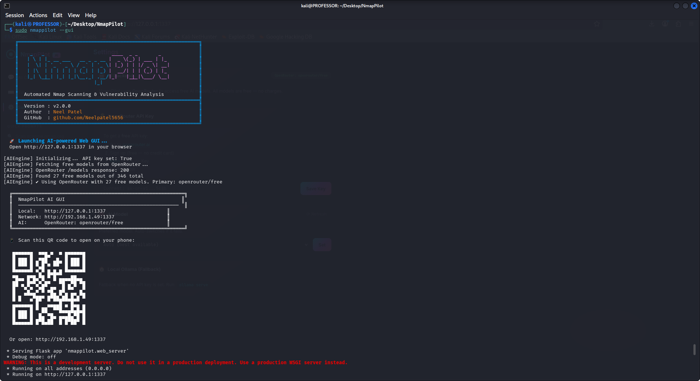
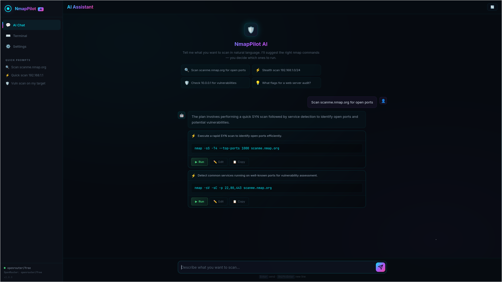
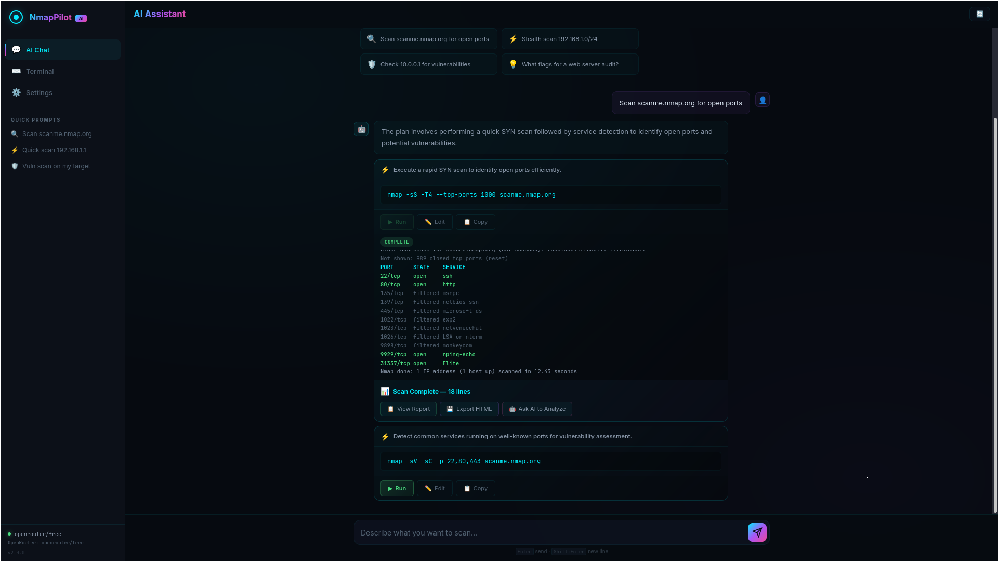
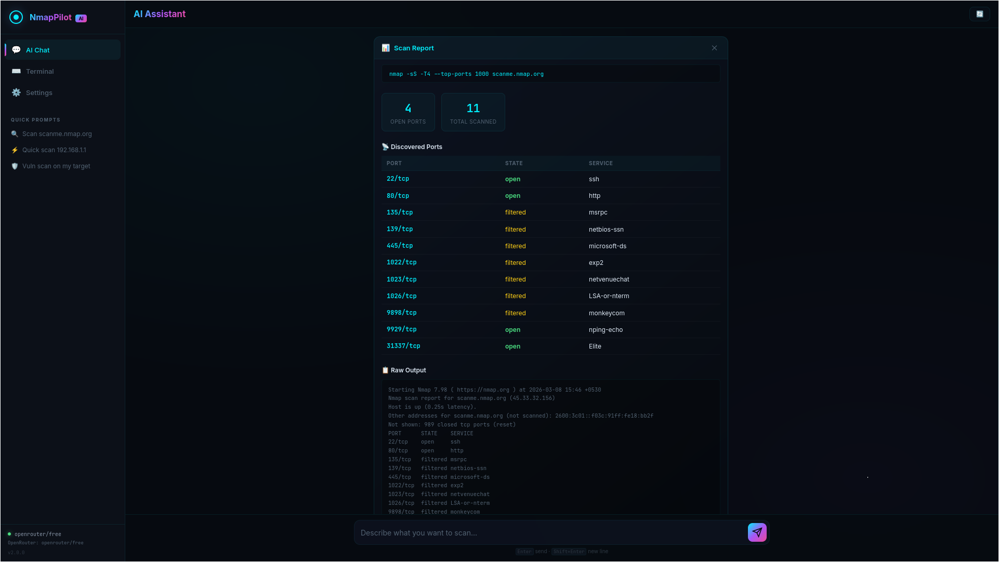
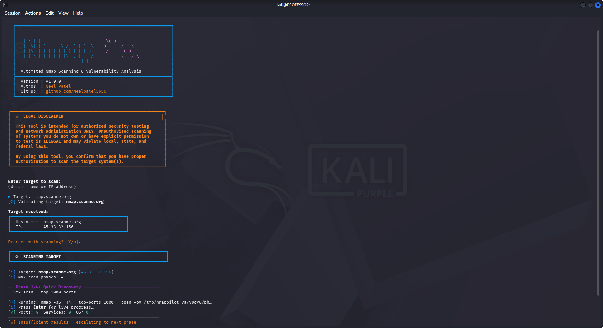
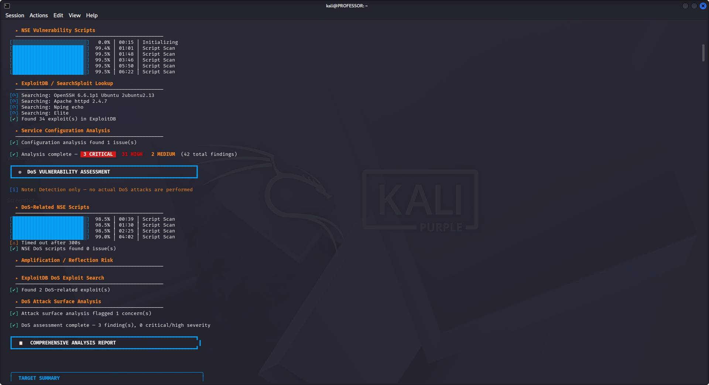
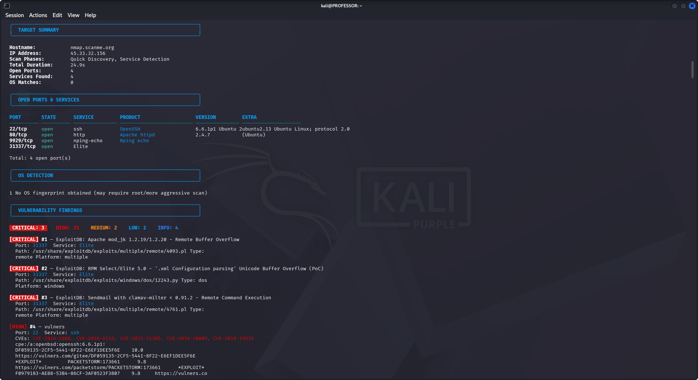
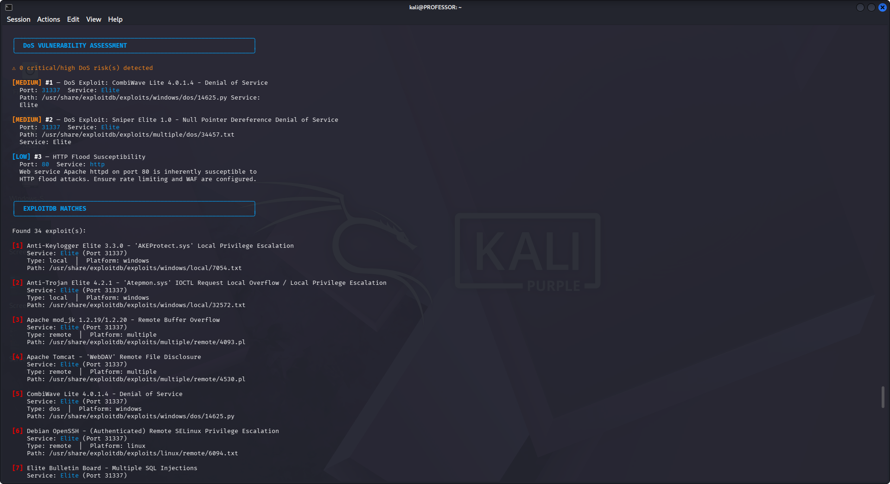
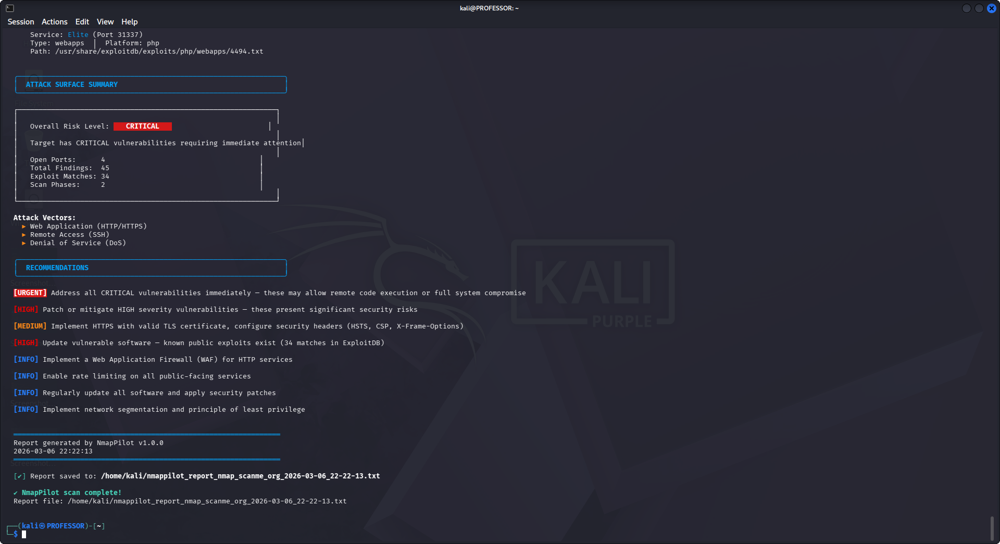

# NmapPilot 🧭

**AI-Powered Nmap Scanning & Vulnerability Analysis Tool**

NmapPilot combines automated nmap reconnaissance with an AI-powered web interface. Tell it what you want to scan in plain English — it suggests the right nmap commands, you review and run them, and get beautiful reports. Supports OpenRouter's free AI models with automatic fallback.

---

## ✨ What's New in v2.0

- 🤖 **AI Chat Interface** — Describe scans in natural language, get valid nmap commands
- 🌐 **Web UI** — Beautiful cyberpunk-themed dashboard with chat, terminal, and settings
- 📱 **Mobile Responsive** — Full mobile support with collapsible sidebar
- 📲 **QR Code on Startup** — Scan to open the UI on your phone instantly
- ✏️ **Editable Commands** — Edit AI-suggested commands before running
- 🔄 **Auto Port Population** — Follow-up commands auto-fill discovered ports
- 📊 **Pretty Reports** — Inline scan report with HTML export
- 🔑 **OpenRouter Integration** — Free AI models with automatic fallback
- 🛡️ **Real nmap Reference** — AI uses actual `nmap --help` for valid syntax

---

## ✨ Features

### AI & Web Interface (v2)
- **Natural Language Scanning** — Describe what you want to scan, AI suggests commands
- **Command Cards** — Run, Edit, or Copy any suggested command
- **Smart Port Tracking** — `<open_ports>` auto-fills with ports from previous scans
- **Live Terminal** — Execute nmap commands directly in the browser
- **Scan Reports** — View formatted results inline or export as standalone HTML
- **AI Analysis** — Send scan results to AI for vulnerability analysis
- **OpenRouter Free Models** — 27+ free AI models with auto-fallback
- **Mobile-First Design** — Responsive UI works on phones and tablets
- **QR Code Access** — Server startup displays QR code for LAN access
- **Settings Panel** — Configure API keys and select AI models from the UI

### CLI Scanning (v1)
- **Progressive Scanning** — 4-phase auto-escalation (Quick → Service → Aggressive → Comprehensive)
- **Smart Escalation** — Only runs deeper scans when initial results are insufficient
- **Vulnerability Analysis** — NSE vuln/exploit/auth scripts + CVE extraction
- **ExploitDB Integration** — Automatic searchsploit queries for discovered services
- **DoS Assessment** — Detects DoS-susceptible services and known DoS CVEs
- **Rich CLI Report** — Color-coded terminal output with severity ratings
- **Report Export** — Saves plain-text report file for documentation

## 📸 Screenshots

### 🌐 Web AI Interface (v2)

#### 1. AI Chat Dashboard


#### 2. Smart Command Suggestions


#### 3. Editable Command Cards


#### 4. Inline Reports & HTML Export


#### 5. Live Nmap Terminal


#### 6. Settings & API Configuration


### 💻 CLI Mode (v1)

#### 1. Quick Discovery Scan


#### 2. Service Detection


#### 3. Aggressive Scanning


#### 4. Vulnerability Analysis


#### 5. Comprehensive Report


## 📋 Requirements

| Dependency | Required | Notes |
|------------|----------|-------|
| **Python** 3.8+ | ✅ | Core runtime |
| **Nmap** | ✅ | Must be in PATH |
| **SearchSploit** | ❌ | Optional — enables ExploitDB integration |
| **Root/sudo** | ✅ | Required for SYN scans and OS detection |

## 🚀 Installation

### One-Command Install (Recommended)

```bash
git clone https://github.com/Neelpatel5656/NmapPilot.git
cd NmapPilot
sudo bash install.sh
```

The installer will:
- Verify Python 3.8+ and nmap are available
- Install NmapPilot system-wide via pip
- Prompt for **OpenRouter API key** (free — [get one here](https://openrouter.ai/keys))
- Configure `sudo nmappilot` to work out of the box

### Manual Install

```bash
cd NmapPilot
pip install .
```

## 🔧 Usage

### Web UI Mode (Recommended)
```bash
sudo nmappilot --gui
```

Opens the AI-powered web interface at `http://localhost:1337`. A **QR code** is displayed in the terminal — scan it to open on your phone.

```bash
# Custom port
sudo nmappilot --gui --port 8080
```

### CLI Mode
```bash
# Interactive mode
sudo nmappilot

# Scan a specific target
sudo nmappilot -t scanme.nmap.org

# Quick scan (max 2 phases)
sudo nmappilot -t 192.168.1.1 -m 2

# Skip DoS assessment
sudo nmappilot -t example.com --no-dos

# Scan only (no vulnerability analysis)
sudo nmappilot -t example.com --no-vuln
```

### CLI Options

| Flag | Description |
|------|-------------|
| `--gui` | Launch the AI web interface |
| `--port` | Port for web UI (default: 1337) |
| `-t, --target` | Target hostname or IP address |
| `-m, --max-phase` | Maximum scan phase (1–4, default: 4) |
| `--no-dos` | Skip DoS vulnerability assessment |
| `--no-vuln` | Skip vulnerability analysis (scan only) |
| `--no-color` | Disable colored output |
| `-v, --version` | Show version number |

## 🤖 AI Configuration

NmapPilot uses **OpenRouter** for AI-powered command generation. Only free models are used — no charges.

### Getting an API Key (Free)
1. Go to [openrouter.ai](https://openrouter.ai/)
2. Sign up (free — no credit card required)
3. Go to [Keys](https://openrouter.ai/keys) → Create Key
4. Enter it during `install.sh` or in the web UI Settings panel

### How It Works
1. **You describe** what you want to scan in plain English
2. **AI suggests** valid nmap commands with explanations
3. **You review & edit** — commands are editable before running
4. **You click Run** — output streams live in the browser
5. **View reports** — pretty formatted results with HTML export
6. **AI analyzes** — send results back to AI for vulnerability insights

### Smart Features
- **Auto Port Fill** — After a scan discovers open ports, follow-up commands automatically substitute `<open_ports>` with the real port list
- **Model Fallback** — If one free model fails, auto-switches to the next available
- **Command Validation** — Only nmap commands are allowed to execute

## 📡 Scan Phases (CLI Mode)

| Phase | Name | Description | Escalation Trigger |
|-------|------|-------------|-------------------|
| 1 | Quick Discovery | SYN scan · top 1000 ports | Always runs first |
| 2 | Service Detection | Version + script scan on open ports | < 3 ports or no versions |
| 3 | Aggressive | Full port range · OS detection | Missing OS/service info |
| 4 | Comprehensive | Full SYN + version + OS + scripts | Last resort |

## 🏗️ Project Structure

```
NmapPilot/
├── install.sh                   # One-command installer (with API key setup)
├── setup.py                     # Package configuration
├── README.md
├── LICENSE
└── nmappilot/
    ├── __init__.py               # Version & package metadata
    ├── __main__.py               # python -m nmappilot entry point
    ├── cli.py                    # Argument parsing & orchestration
    ├── ai_engine.py              # OpenRouter AI + nmap reference prompt
    ├── web_server.py             # Flask + SocketIO web UI server
    ├── scanner.py                # Progressive scan engine
    ├── analyzer.py               # Vulnerability analysis (NSE + ExploitDB)
    ├── dos_checker.py            # DoS vulnerability assessment
    ├── reporter.py               # CLI report generator
    ├── colors.py                 # ANSI color definitions
    ├── ui.py                     # Banner, headers, status messages
    ├── target.py                 # Target validation & DNS resolution
    ├── nmap_runner.py            # PTY-based nmap execution
    ├── xml_parser.py             # Nmap XML output parser
    ├── helpers.py                # Timestamps, root check
    ├── utils.py                  # Backward-compatible re-export shim
    ├── templates/
    │   └── index.html            # Web UI template
    └── static/
        ├── css/style.css         # Cyberpunk dark theme + mobile responsive
        └── js/app.js             # Frontend logic (chat, terminal, reports)
```

## 🔒 Security

- API keys stored locally in `~/.config/nmappilot/config.json`
- Config files excluded from git via `.gitignore`
- Only `nmap` commands can be executed through the web UI
- Server runs on `0.0.0.0` for LAN access — use on trusted networks only

## ⚠️ Legal Disclaimer

This tool is intended for **authorized security testing and network administration only**. Unauthorized scanning of systems you do not own or have explicit permission to test is illegal and may violate local, state, and federal laws. By using this tool, you confirm proper authorization.

## 📄 License

MIT
